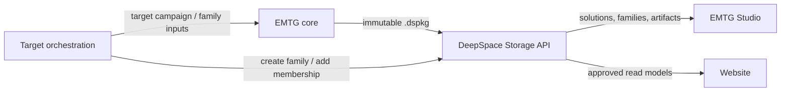

# EMTG solution service architecture

EMTG core, DeepSpace Storage, EMTG Studio, target orchestration, and the public
website are separate deployable projects.

## Ownership

EMTG owns trajectory optimization, native `.emtg` output, short-lived
campaign/checkpoint/cache state, and construction of the versioned `.dspkg`
handoff. It never imports the storage service or writes its database.

DeepSpace Storage owns durable content-addressed artifacts, the rebuildable
search index, solution-family definitions, parameter axes, branches, sample
coordinates and classifications, family lineage, and family membership
revision history. Its HTTP API and CLI/Windows executable are the only
cross-project write boundary.

EMTG Studio owns internal visualization and comparison. It reads solutions and
families through DeepSpace and has no private solution database.

Target orchestration owns target discovery and run coordination. It may ingest
a package and add it to a family through the DeepSpace client/API. Operational
orchestrator state is not a solution family.

The public website consumes an explicitly approved read projection. It should
not receive filesystem paths or storage administration credentials.

## Package boundary

`PyEMTG.Solution` creates DeepSpace package contract v1:

- canonical `manifest.json` and deterministic package identity;
- native EMTG output and supplied run artifacts;
- normalized solution summary;
- event trajectory JSON with explicit frame and time system;
- SHA-256 and byte count for every artifact.

Outer-loop evaluations add `solution-package` to their artifact map
automatically. Packaging failure is recorded in evaluation provenance without
discarding the native scientific result. Standalone results use
`python -m PyEMTG.Solution`.

## Family boundary

Packages are immutable. Families are revisioned collections of package IDs.
The shared family identity is `fam_<sha256>`, and parameter axes use the
canonical `axes[].key` field. `FamilyDefinition.to_dict()` is therefore
directly representable in a DeepSpace family resource.

`PyEMTG.Solution.family_resource_payload()` maps an operational EMTG family to
the DeepSpace family-create interface, while
`family_membership_payload()` maps a completed EMTG sample to membership
classification, coordinates, branch, ordinal, and provenance. Generated
solution packages also carry their family and sample identity in
`metadata.family`, so publishers can ingest and attach a package without
reconstructing transient solver state.

Every family mutation uses optimistic revision checks when concurrent writers
are possible. EMTG defines and evaluates the operational family, but only
DeepSpace persists or changes its authoritative resource and memberships.
